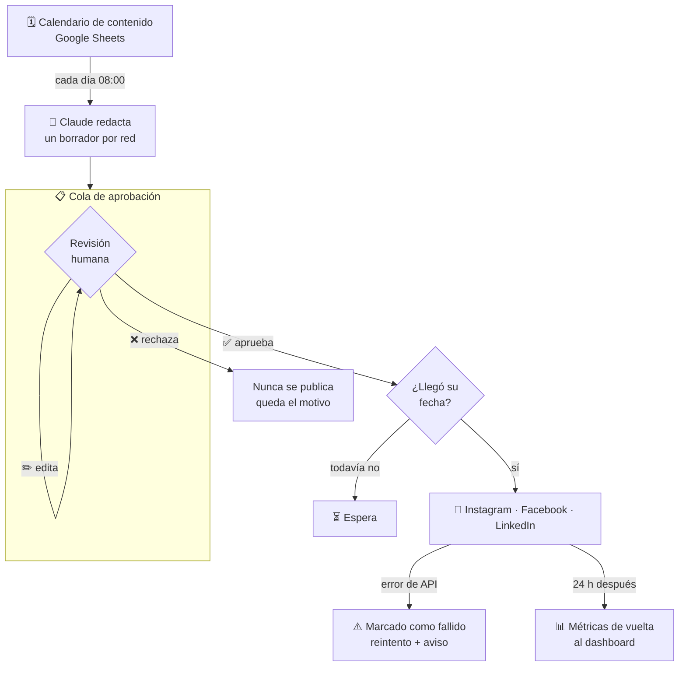
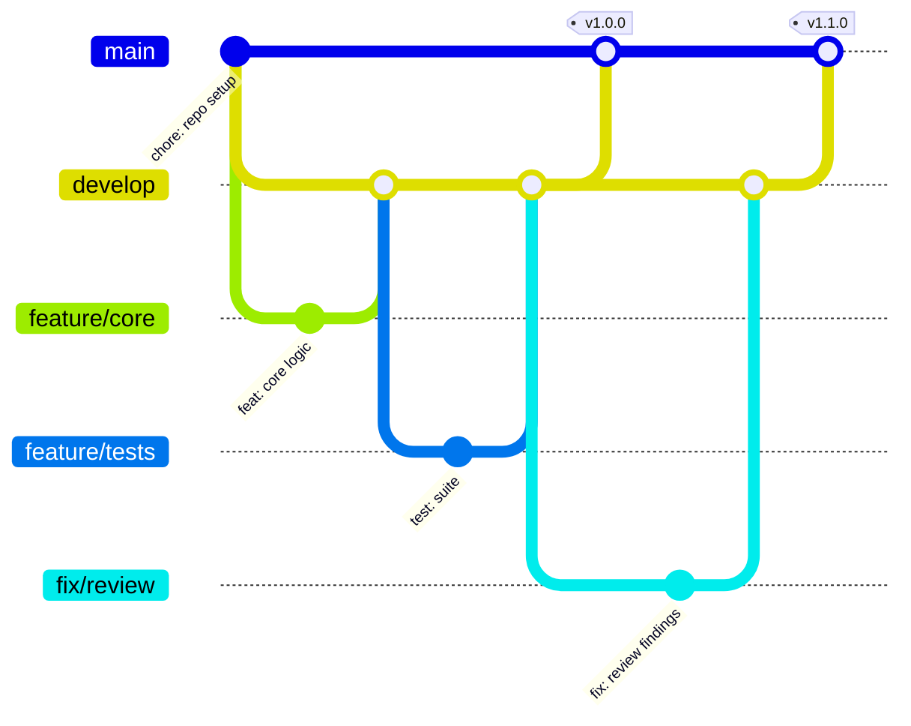

<h1 align="center">Publicador de redes con IA</h1>

<p align="center"><i>La IA redacta, una persona aprueba, el sistema publica</i></p>

<p align="center">  -8A63D2) </p>

---

## 🎥 Demo en video

<!-- ────────────────────────────────────────────────────────────────────
     ESPACIO RESERVADO PARA EL VIDEO

     Cuando lo tengas subido a YouTube (recomiendo "no listado"), reemplaza
     este bloque por la miniatura clickeable:

     [](https://youtu.be/TU_VIDEO_ID)

     Y borra el aviso de abajo.
     ──────────────────────────────────────────────────────────────────── -->

> 🎬 *Video de la demo en camino.* Mientras tanto, el proyecto corre completo
> en local en menos de dos minutos siguiendo [⚡ Probarlo](#-probarlo-en-2-minutos).

---

## 🎯 El problema

Adaptar cada pieza de contenido a Instagram, Facebook, LinkedIn y TikTok —con su largo, su tono y sus hashtags— consume horas por semana. Automatizarlo del todo tampoco sirve: publicar sin revisar, en nombre de una organización que trabaja con menores, es inaceptable.

## 💡 Qué hace este proyecto

1. **Un borrador por red**, con las reglas propias de cada una: LinkedIn sin emojis y tono institucional, TikTok corto y directo, Instagram con sus hashtags.
2. **Cola de aprobación**: una persona aprueba, edita o rechaza. Lo editado vuelve a revisión.
3. **Publicación programada** multicanal, solo de lo aprobado y en su fecha.
4. **Nada se pierde en silencio**: si la API de una red falla, el post queda marcado y se reintenta, con aviso al equipo.
5. **Mide qué funciona**: compara el rendimiento del texto de IA contra el editado por humanos.

---

## 🗺️ Cómo funciona



---

## ⚡ Probarlo en 2 minutos

```bash
pip install pytest
python scripts/generar_calendario.py    # 14 contenidos ficticios
python scripts/simular_publicacion.py   # el ciclo completo end-to-end
python -m pytest -v                     # 44 tests
```

Funciona **sin API key**: trae un motor de plantillas equivalente. Con
`ANTHROPIC_API_KEY` usa Claude de verdad (`--motor claude`).

---

### 🔒 La regla de oro está en el código, no en el README

```python
def test_no_se_puede_publicar_sin_aprobacion():
    with pytest.raises(ErrorAprobacion, match="revisión humana"):
        cola.publicar(clave)
```

`publicar()` lanza excepción si el post no fue aprobado por una persona, y el nodo de n8n aplica exactamente el mismo filtro. Hay tests para ambos: una promesa en la documentación se puede olvidar, un test no.

---

## 📁 Estructura

```
├── src/
│   ├── generador.py           # reglas por red + motores plantillas/Claude
│   └── cola_aprobacion.py     # estados, revisión humana, reintentos
├── workflows/
│   ├── workflow_1_generar.json   # calendario → Claude → cola
│   └── workflow_2_publicar.json  # aprobados → redes → métricas
├── prompts/                   # prompts versionados
├── scripts/                   # data ficticia y simulación
└── tests/                     # 44 tests
```

---

## 🌿 Flujo de trabajo con Git

El repositorio sigue **Git Flow**: `main` siempre desplegable, `develop` como
integración, y una rama por cambio. Los merges son `--no-ff` para que cada
funcionalidad quede como un bloque legible en el historial, y cada versión
lleva su tag.



| Rama | Para qué |
| --- | --- |
| `main` | Solo versiones liberadas. Cada merge lleva su tag. |
| `develop` | Integración de todo lo terminado. |
| `feature/*` | Una funcionalidad nueva. |
| `fix/*` | Una corrección concreta. |
| `release/*` | Preparación de la versión, luego se fusiona a `main` y `develop`. |

Los mensajes siguen [Conventional Commits](https://www.conventionalcommits.org/):
`feat:`, `fix:`, `test:`, `docs:`, `chore:` — con el porqué del cambio en el
cuerpo, no solo el qué.

---

## 📚 Documentación

| Documento | Contenido |
| --- | --- |
| [`GUIA.md`](GUIA.md) | Guía técnica completa: arquitectura, decisiones, configuración y puesta en marcha |
| [`POLITICA_REVISION.md`](POLITICA_REVISION.md) | Checklist del aprobador, roles y qué NO se automatiza a propósito |
| [`prompts/`](prompts/) | Prompts versionados con criterios de aceptación y reglas de protección de menores |

---

## 📄 Licencia

[MIT](LICENSE) · Daniel Yataco Blas

> Proyecto de demostración construido con **datos ficticios**. No es un sistema
> en producción de ninguna organización.
