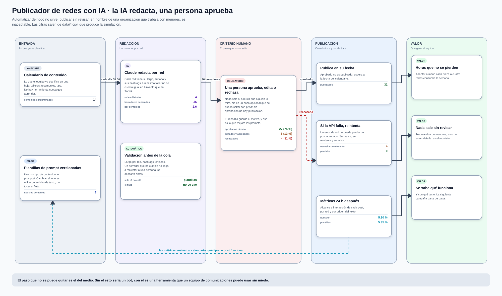
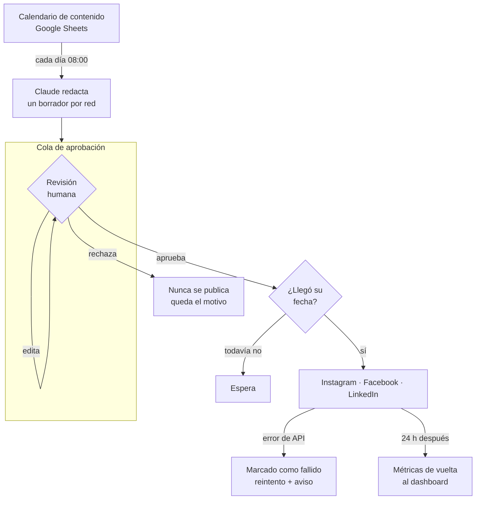
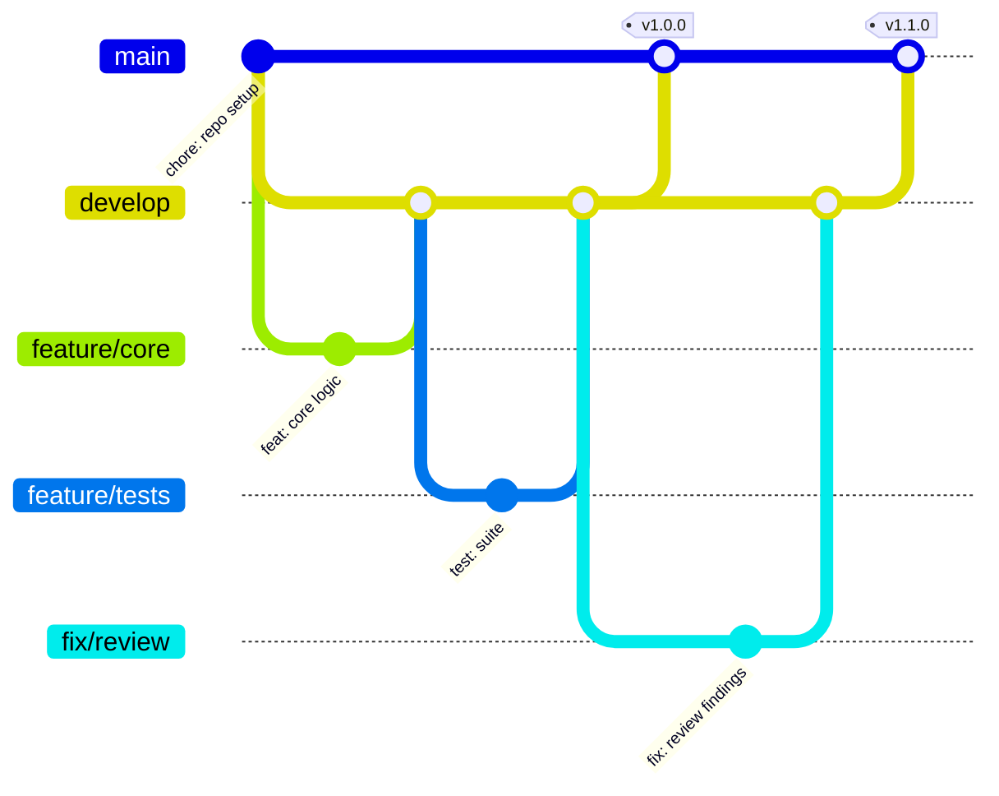

<h1 align="center">Publicador de redes con IA</h1>

<p align="center"><i>La IA redacta, una persona aprueba, el sistema publica</i></p>

<p align="center">
  
  
  
  
</p>


<p align="center">
  <a href="docs/flujo.svg">
    
  </a>
</p>

<sub>Ábrelo en grande: <a href="docs/flujo.svg"><code>docs/flujo.svg</code></a>.
Las cifras de las tarjetas no están escritas a mano — las pone
<a href="scripts/diagrama.py"><code>scripts/diagrama.py</code></a> leyendo
<code>data/*.csv</code>, que produce la simulación. Si cambian los datos, se vuelve a correr y el dibujo se corrige
solo.</sub>

---

## Para qué existe este repositorio

Adaptar cada pieza de contenido a Instagram, Facebook, LinkedIn y TikTok —con su largo, su tono y sus hashtags— consume horas por semana. Automatizarlo del todo tampoco sirve: publicar sin revisar, en nombre de una organización que trabaja con menores, es inaceptable.

**Este proyecto redacta un borrador por red social, lo deja en una cola donde una persona aprueba, edita o rechaza, y solo entonces publica en la fecha programada.**



---

## La demo, en una orden

```console
$ python scripts/simular_publicacion.py

=== Publicador de redes con IA (simulación local) ===

Motor de generación: plantillas
Contenidos del calendario: 14
Borradores generados y válidos: 36

Revisión humana (obligatoria antes de publicar):
  ✓ aprobados directo: 27
  ~ editados y aprobados: 5
  ✗ rechazados: 4

! 4 publicaciones fallaron → reintento automático

Publicación:
  ✓ publicados: 32
  ✗ fallidos tras reintentos: 0
  · rechazados (nunca se publican): 4

Tasa de interacción por origen del texto:
  humano       5.30 %  (5 posts)
  plantillas   5.95 %  (27 posts)

✓ data\borradores.csv (36 filas — así lo ve el equipo)
✓ data\publicados.csv (32 filas)
✓ data\metricas.csv (32 filas)
```

Ese es el ciclo entero: 14 entradas del calendario se convierten en 36
borradores adaptados a cada red, **una persona los aprueba, edita o rechaza**,
y solo entonces se publican. Los cuatro rechazados no se publican por ninguna
vía, y hay tests que fallan si alguien intenta saltarse ese paso.

La última tabla compara el rendimiento del texto generado contra el editado a
mano: así se decide con datos si merece la pena editar más o menos.

---

## Qué hace este proyecto

1. **Un borrador por red**, con las reglas propias de cada una: LinkedIn sin emojis y tono institucional, TikTok corto y directo, Instagram con sus hashtags.
2. **Cola de aprobación**: una persona aprueba, edita o rechaza. Lo editado vuelve a revisión.
3. **Publicación programada** multicanal, solo de lo aprobado y en su fecha.
4. **Nada se pierde en silencio**: si la API de una red falla, el post queda marcado y se reintenta, con aviso al equipo.
5. **Mide qué funciona**: compara el rendimiento del texto de IA contra el editado por humanos.

---

## Cómo funciona por dentro

El recorrido completo está en el diagrama del principio. Estas son las piezas que lo ejecutan:

---

## Probarlo en 2 minutos

```bash
pip install pytest
python scripts/generar_calendario.py    # 14 contenidos ficticios
python scripts/simular_publicacion.py   # el ciclo completo end-to-end
python -m pytest -v                     # 44 tests
```

Funciona **sin API key**: trae un motor de plantillas equivalente. Con
`ANTHROPIC_API_KEY` usa Claude de verdad (`--motor claude`).

---

### La regla de oro está en el código, no en el README

```python
def test_no_se_puede_publicar_sin_aprobacion():
    with pytest.raises(ErrorAprobacion, match="revisión humana"):
        cola.publicar(clave)
```

`publicar()` lanza excepción si el post no fue aprobado por una persona, y el nodo de n8n aplica exactamente el mismo filtro. Hay tests para ambos: una promesa en la documentación se puede olvidar, un test no.

---

## Estructura

```
├── src/
│   ├── generador.py           # reglas por red + motores plantillas/Claude
│   └── cola_aprobacion.py     # estados, revisión humana, reintentos
├── workflows/
│   ├── workflow_1_generar.json   # calendario → Claude → cola
│   └── workflow_2_publicar.json  # aprobados → redes → métricas
├── prompts/                   # prompts versionados
├── scripts/                   # data ficticia y simulación
└── tests/                     # 44 tests
```

---

## Flujo de trabajo con Git

El repositorio sigue **Git Flow**: `main` siempre desplegable, `develop` como
integración, y una rama por cambio. Los merges son `--no-ff` para que cada
funcionalidad quede como un bloque legible en el historial, y cada versión
lleva su tag.



| Rama | Para qué |
| --- | --- |
| `main` | Solo versiones liberadas. Cada merge lleva su tag. |
| `develop` | Integración de todo lo terminado. |
| `feature/*` | Una funcionalidad nueva. |
| `fix/*` | Una corrección concreta. |
| `release/*` | Preparación de la versión, luego se fusiona a `main` y `develop`. |

Los mensajes siguen [Conventional Commits](https://www.conventionalcommits.org/):
`feat:`, `fix:`, `test:`, `docs:`, `chore:` — con el porqué del cambio en el
cuerpo, no solo el qué.

---

## Documentación

| Documento | Contenido |
| --- | --- |
| [`GUIA.md`](GUIA.md) | Guía técnica completa: arquitectura, decisiones, configuración y puesta en marcha |
| [`POLITICA_REVISION.md`](POLITICA_REVISION.md) | Checklist del aprobador, roles y qué NO se automatiza a propósito |
| [`prompts/`](prompts/) | Prompts versionados con criterios de aceptación y reglas de protección de menores |

---

## Licencia

[MIT](LICENSE) · Daniel Yataco Blas

> Proyecto de demostración construido con **datos ficticios**. No es un sistema
> en producción de ninguna organización.
